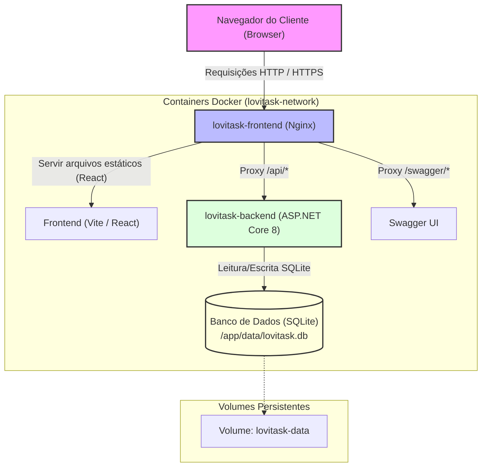

# Documentação de Infraestrutura — LoviTask

Esta documentação detalha a arquitetura de infraestrutura do LoviTask, as configurações de ambiente, o setup para desenvolvimento e produção, e as instruções de deploy.

---

## 1. Arquitetura da Infraestrutura

O LoviTask é estruturado em containers Docker, orchestrados pelo Docker Compose para desenvolvimento local e setups simples de produção.

### Fluxo de Dados e Componentes

O fluxo de dados entre os componentes do sistema é ilustrado abaixo:



---

## 2. Guia de Instalação e Execução Local

### Pré-requisitos
- **Docker** (versão 20.10.0 ou superior)
- **Docker Compose** (versão 2.0.0 ou superior)

### Passo a Passo

1. **Configurar o Ambiente**:
   Copie as variáveis de exemplo para o seu arquivo `.env`:
   ```bash
   cp .env.example .env
   ```
   Ajuste as portas ou caminhos se necessário. Por padrão, o backend rodará na porta `5000` (interna) e o frontend na porta `80` (externa).

2. **Subir os Containers (Desenvolvimento)**:
   Use o comando abaixo para construir e iniciar os containers em primeiro plano:
   ```bash
   docker compose up --build
   ```
   *Nota: O backend possui um Health Check automático e o frontend aguardará o backend estar saudável para ser ativado.*

3. **Verificar os Serviços**:
   Após o startup completo, acesse:
   - **Frontend**: [http://localhost](http://localhost)
   - **Swagger da API**: [http://localhost/swagger](http://localhost/swagger) (através do proxy do Nginx) ou direto pelo backend em [http://localhost:5000/swagger](http://localhost:5000/swagger)
   - **Endpoint de Saúde (Healthcheck)**: [http://localhost:5000/api/health](http://localhost:5000/api/health)

4. **Encerrar a Execução**:
   Para parar e remover os containers e redes criadas:
   ```bash
   docker compose down
   ```
   Para apagar também os volumes de dados persistentes (reseta o banco de dados):
   ```bash
   docker compose down -v
   ```

---

## 3. Variáveis de Ambiente

As configurações do sistema são controladas através de variáveis declaradas no arquivo `.env`.

| Variável | Descrição | Valor Padrão / Sugerido | Obrigatória? | Escopo |
| :--- | :--- | :--- | :---: | :--- |
| `DB_TYPE` | Tipo do banco de dados utilizado. Atualmente suportado: `sqlite`. | `sqlite` | Sim | Backend |
| `DB_PATH` | Caminho do arquivo de banco de dados SQLite dentro do container. | `/app/data/lovitask.db` | Sim (se `DB_TYPE=sqlite`) | Backend |
| `APP_ENV` | Define o ambiente da aplicação (`development` ou `production`). | `development` | Sim | Backend |
| `ASPNETCORE_ENVIRONMENT` | Define o perfil de execução do ASP.NET. | `${APP_ENV}` | Sim | Backend |
| `APP_PORT` | Porta mapeada no host para acessar a API diretamente. | `5000` | Sim | Compose (Backend) |
| `DEBUG_MODE` | Habilita logs detalhados e verbosidade no console. | `true` | Sim | Backend |
| `FRONTEND_PORT` | Porta mapeada no host para acessar a interface web (Nginx). | `80` | Sim | Compose (Frontend) |

---

## 4. Instruções de Deploy (Produção)

Para colocar a aplicação em produção, utilize o arquivo otimizado `docker-compose.prod.yml`.

### Executar em Produção
Execute o compose passando o arquivo de produção específico:
```bash
docker compose -f docker-compose.prod.yml up --build -d
```
O parâmetro `-d` garante que os containers rodem em background (modo daemon).

### Otimizações e Diferenças no Setup de Produção:
- **Execução como Usuário Não-Root**: O container do backend do .NET executa sob o usuário `USER app` (UID 1654), que não possui privilégios administrativos no container ou no host.
- **Resource Limits (Docker Deploy)**: Limita o consumo de CPU e RAM para evitar que um vazamento de memória ou loop infinito consuma todos os recursos do servidor host.
  - **Backend**: Limite de 1.0 CPU e 512MB RAM (Reserva de 0.25 CPU e 128MB RAM).
  - **Frontend**: Limite de 0.5 CPU e 256MB RAM (Reserva de 0.1 CPU e 64MB RAM).
- **Políticas de Reinicialização**: Em produção, `restart: always` garante que se um container quebrar por falta de memória ou falha do sistema, o Docker o reiniciará automaticamente.
- **Armazenamento de Dados Isolado**: Utiliza volumes persistentes distintos (`lovitask-data-prod`) para que os dados de teste locais não se misturem com dados reais de produção.
- **Compressão Gzip no Nginx**: Reduz consideravelmente o tráfego de rede e tempo de renderização comprimindo arquivos JS/CSS/SVG em tempo real.
